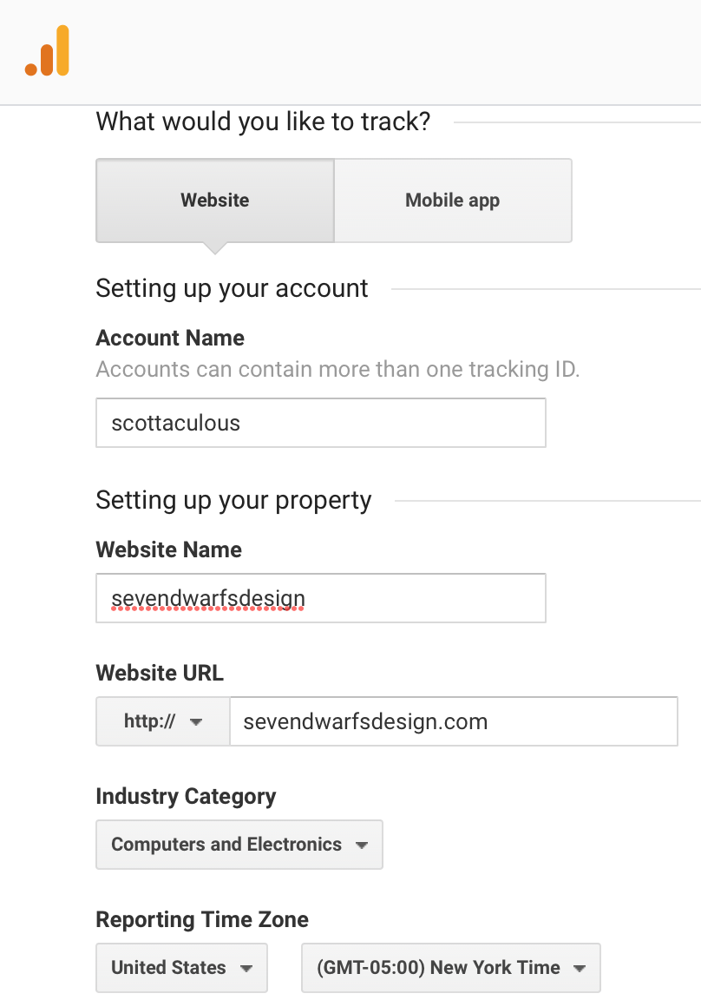

#

My first task was making deployment of this site easy by installing AWS Amplify

1. Fix the development environment issues
2. Commit to source control
3. Deploy
4. Automate deployment

## Step 0 - Fix the errors

Got these errors on Visual Studo Code (vscode)

Message:

``` bash
    npm WARN deprecated circular-json@0.3.3: CircularJSON is in maintenance only, flatted is its successor.
    npm WARN deprecated kleur@2.0.2: Please upgrade to kleur@3 or migrate to 'ansi-colors' if you prefer the old syntax. Visit <https://github.com/lukeed/kleur/releases/tag/v3.0.0\> for migration path(s).
    npm WARN deprecated minimatch@2.0.10: Please update to minimatch 3.0.2 or higher to avoid a RegExp DoS issue
```

Fix was to enter these commands on the terminal:

``` bash
    npm install -g kleur@3
    npm install -g minimatch@3.0.2`
```

## Step 1 - Commit to source

I'm using Github.  You can find the code there.

## Step 2 - Deploy

Deploying fast and smooth is first priority when a developer sets up their environment.  My goal is to deploy the content I write to AWS S3 after linting with a push of a command.

I am following the Gatsby Guide on deploy to S3 <https://www.gatsbyjs.org/docs/deploying-to-s3-cloudfront>

All the help is focused on creating new resources.  In my case, Amplify needs to be configured to use existing resources.

## Step 3 - Automate pipeline

Setting up Google Analytics
Monitoring your site gets more important as you get real users.  I'm ahead of myself since I didn't even register myself with Google (the search engine).  At least I can see the site's progression from zero.

[Link](https://analytics.google.com/analytics/web/)

TODO: How do I resize an image in markup?


### Step 4 - Gatsby Setup

    1. Imported Gatsby image
